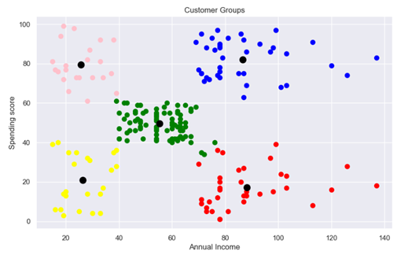

# Customer-segmentation-Analysis

This repository contains a customer segmentation analysis for a mall using the K-Means clustering algorithm. The project aims to group customers into distinct segments based on their annual income and spending score to inform targeted marketing strategies.

## Project Overview

The primary goal is to develop an intelligent customer segmentation system that analyzes mall customer data. By clustering customers into meaningful groups, the mall can enhance marketing efforts, improve customer experience, and support better business decision-making. This project utilizes unsupervised machine learning, specifically K-Means clustering, to achieve this.

## Dataset

The analysis uses the `Mall_Customers.xlsx` dataset, which includes the following columns:
*   `CustomerID`
*   `Gender`
*   `Age`
*   `Annual Income (k$)`
*   `Spending Score (1-100)`

The dataset was found to be clean, with no missing or duplicate values.

## Methodology

The analysis follows these key phases:

1.  **Data Loading and Initial Analysis**: The dataset is loaded using pandas for a preliminary review of its structure and statistics.
2.  **Feature Selection**: For this clustering task, `Annual Income (k$)` and `Spending Score (1-100)` are selected as the key features for segmentation.
3.  **Determining the Optimal Number of Clusters**: The Elbow Method is applied by calculating the Within-Cluster Sum of Squares (WCSS) for a range of cluster counts (1 to 10). The "elbow" point in the resulting plot indicates the optimal number of clusters.
4.  **Model Training**: A K-Means model is trained on the selected features. Based on the Elbow Method, the model is configured to create 5 clusters.
5.  **Cluster Visualization**: The final customer segments are visualized using a scatter plot to show the distribution of customers based on their income and spending habits.

## Results: Customer Segments

The K-Means algorithm successfully grouped the customers into five distinct clusters. The visualization below displays these groups, with each color representing a different segment and the black dots indicating the cluster centroids.



### Cluster Interpretation

Based on the scatter plot, the five customer segments can be described as:

*   **Cluster 1 (Green - Standard)**: Customers with average annual income and an average spending score.
*   **Cluster 2 (Blue - Careful)**: Customers with high annual income but a low spending score. This group is financially cautious.
*   **Cluster 3 (Red - Target)**: Customers with high annual income and a high spending score. This is a prime target group for marketing.
*   **Cluster 4 (Yellow - Low-Income/Low-Spending)**: Customers with low annual income and a low spending score.
*   **Cluster 5 (Pink - High-Spending/Low-Income)**: Customers with low annual income but a high spending score.

These insights can help the mall tailor promotions, loyalty programs, and store layouts to better serve each customer segment.

## How to Run

To replicate this analysis, follow these steps:

1.  Clone the repository:
    ```sh
    git clone https://github.com/ayeshakhan77/Customer-segmentation-Analysis.git
    cd Customer-segmentation-Analysis
    ```

2.  Install the required Python libraries:
    ```sh
    pip install numpy pandas matplotlib seaborn scikit-learn openpyxl
    ```

3.  Run the Jupyter Notebook `Customer segmentation.ipynb` in an environment like Jupyter Lab or Google Colab to see the step-by-step analysis and results.
